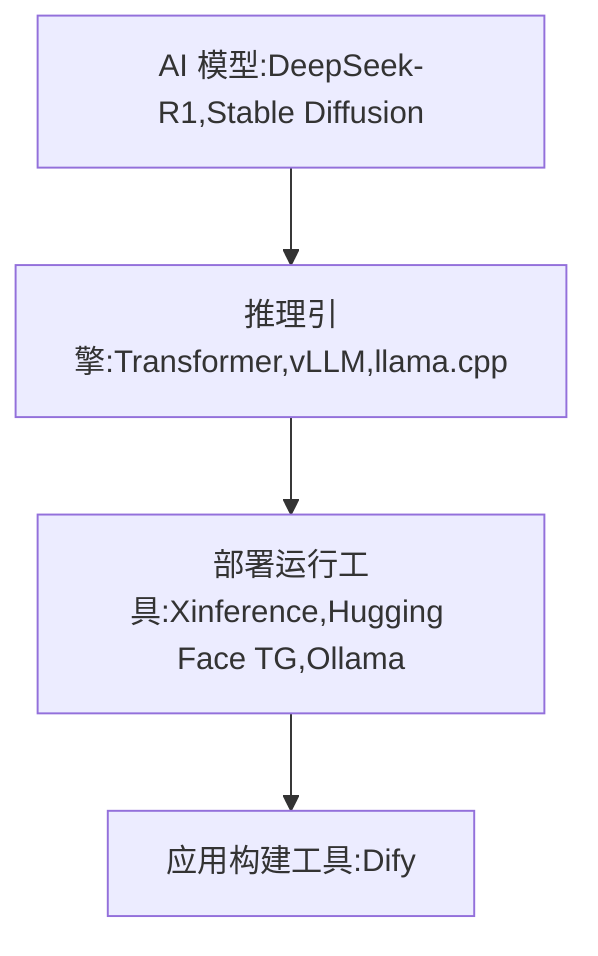

# 14.1 大模型

## 14.1.1 大模型核心概念
- **大语言模型（LLM，Large Language Model）**：它属于深度学习模型，借助海量文本数据进行训练，能够处理和生成自然语言。它具备强大的语言理解和生成能力，可用于问答系统、文本生成、机器翻译等众多自然语言处理任务。例如 ChatGPT、百度文心一言等都属于大语言模型    

- **文本嵌入（Text Embedding）**：这是一种把文本转换为向量的技术。在自然语言处理里，计算机无法直接理解文本，所以需要将文本转换为向量形式，以便计算机进行处理。文本嵌入能够把文本映射到低维向量空间，使得语义相近的文本在向量空间中的距离也相近。这样的向量表示可用于文本分类、信息检索、文本相似度计算等任务    

- **重排序（Rerank）**：在信息检索系统中，初始检索通常会依据某种算法给出一个文档的排序结果。不过这个初始排序可能并非最优，重排序就是在初始排序的基础上，运用更复杂的算法和特征对文档进行再次排序，从而提升检索结果的质量。比如在搜索引擎中，重排序能够让与用户查询更相关的网页排在更靠前的位置    

<!-- - **语音转文本（STT，Speech to text）**：该技术可以将语音信号转换为文本。它借助音频处理和机器学习算法，对语音信号进行分析和识别，把语音中的文字内容提取出来。语音转文本在语音助手、会议记录、视频字幕生成等场景中应用广泛       

- **文本转语音（TTS，Text to Speech）**：这是与语音转文本相反的技术，它能够将文本转换为语音。TTS 系统会对输入的文本进行分析，然后根据语音合成算法生成相应的语音信号。文本转语音常用于有声读物、导航系统、智能客服等场景。     -->

<!-- LLM:大模型
RAG：检索增强
chunk：内容切片
embedding：片段向量化
vectorDB：向量化数据库
AI Agent：就是 可以利用外部工具帮你干活 
MCP：串联AI Agent生态的协议
Distill：蒸馏
Prompt：提示词 -->

<!-- [ollama中文文档](https://ollama.cadn.net.cn/#quickstart) -->

<!-- 
引擎比较：
| 引擎                 | 开发团队        | 核心目标                       | 模型支持范围       |
| -------------------- | --------------- | ------------------------------ | ------------------ |
| **Transformer** (HF) | Hugging Face    | 提供全流程工具（训练/推理）    | 极广（数千种模型） |
| **vLLM**             | UC Berkeley     | 高性能LLM推理（生产级）        | 主流LLM（PyTorch） |
| **llama.cpp**        | Georgi Gerganov | 轻量化本地运行（CPU/边缘设备） | GGUF量化模型       |

部署运行工具：
| 特性           | Hugging Face (TGI/Transformers) | Ollama           | Xinference        |
| -------------- | ------------------------------- | ---------------- | ----------------- |
| **核心用户**   | 研究者/开发者                   | 个人用户         | 企业/团队         |
| **模型支持**   | 极广（HF Hub）                  | 有限（精选模型） | 中（支持主流LLM） |
| **部署复杂度** | 高（需配置环境）                | 极低（一键运行） | 中（需集群管理）  |
| **性能**       | 高（TGI/vLLM）                  | 低（适合本地）   | 高（分布式扩展）  |
| **硬件适配**   | 需NVIDIA GPU（TGI）             | CPU/Metal/CUDA   | CPU/GPU/分布式    |
| **典型场景**   | 训练+生产级API                  | 本地快速体验     | 企业内网服务      |
 -->

## 推理模型与非推理模型

* 推理大模型： 推理大模型是指能够在传统的大语言模型基础上，强化推理、逻辑分析和决策能力的模型。它
们通常具备额外的技术，比如强化学习、神经符号推理、元学习等，来增强其推理和问题解决能力。
例如：DeepSeek-R1，GPT-o3在逻辑推理、数学推理和实时问题解决方面表现突出。

* 非推理大模型： 适用于大多数任务，非推理大模型一般侧重于语言生成、上下文理解和自然语言处理，而不强
调深度推理能力。此类模型通常通过对大量文本数据的训练，掌握语言规律并能够生成合适的内容，但缺乏像
推理模型那样复杂的推理和决策能力。

例如：GPT-3、GPT-4（OpenAI），BERT（Google），主要用于语言生成、语言理解、文本分类、翻译
等任务

| 维度     | 推理模型                                         | 通用模型                                       |
| -------- | ------------------------------------------------ | ---------------------------------------------- |
| 优势领域 | 数学推导、逻辑分析、代码生成、复杂问题拆解       | 文本生成、创意写作、多轮对话、开放性问答       |
| 劣势领域 | 发散性任务（如诗歌创作）                         | 需要严格逻辑链的任务（如数学证明）             |
| 性能本质 | 专精于逻辑密度高的任务                           | 擅长多样性高的任务                             |
| 强弱判断 | 并非全面更强，仅在其训练目标领域显著优于通用模型 | 通用场景更灵活，但专项任务需依赖提示语补偿能力 |
| 提示语策 | 1. 提示语更简洁，只需明确任务目标和需求（因其已内化推理逻辑）  2. 无需逐步指导，模型自动生成结构化推理过程（若强行拆解步骤，反而可能限制其能力）。 | 1. 需显式引导推理步骤（如通过CoT提示），否则可能跳过关键逻辑   2. 依赖提示语补偿能力短板（如要求分步思考、提供示例） |

## 概率预测与链式推理

|          | 概率预测（快速反应模型，如ChatGPT 4o）     | 链式推理(慢速思考模型，如OpenAI o1)                |
| ------------ | ------------------------------------------ | -------------------------------------------------- |
| 性能表现     | 响应速度快，算力成本低                     | 慢速思考，算力成本高                               |
| 运算原理     | 基于链式思维（Chain-of-Thought），逐步推理 | 问题的每个步骤来得到答案                           |
| 决策能力     | 依赖预设算法和规则进行决策                 | 能够自主分析情况，实时做出决策                     |
| 创造力       | 限于模式识别和优化，缺乏真正的创新能力     | 能够生成新的创意和解决方案，具备创新能力           |
| 人机互动能力 | 按照预设脚本响应，较难理解人类情感和意图   | 更自然地与人互动，理解复杂情感和意图               |
| 问题解决能力 | 擅长解决结构化和定义明确的问题             | 能够处理多维度和非结构化问题，提供创造性的解决方案 |
| 伦理问题     | 作为受控工具，几乎没有伦理问题             | 引发自主性和控制问题的伦理讨论                     |

