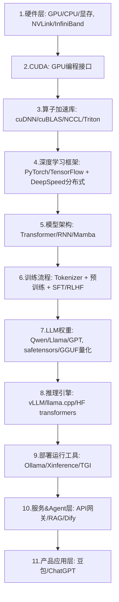
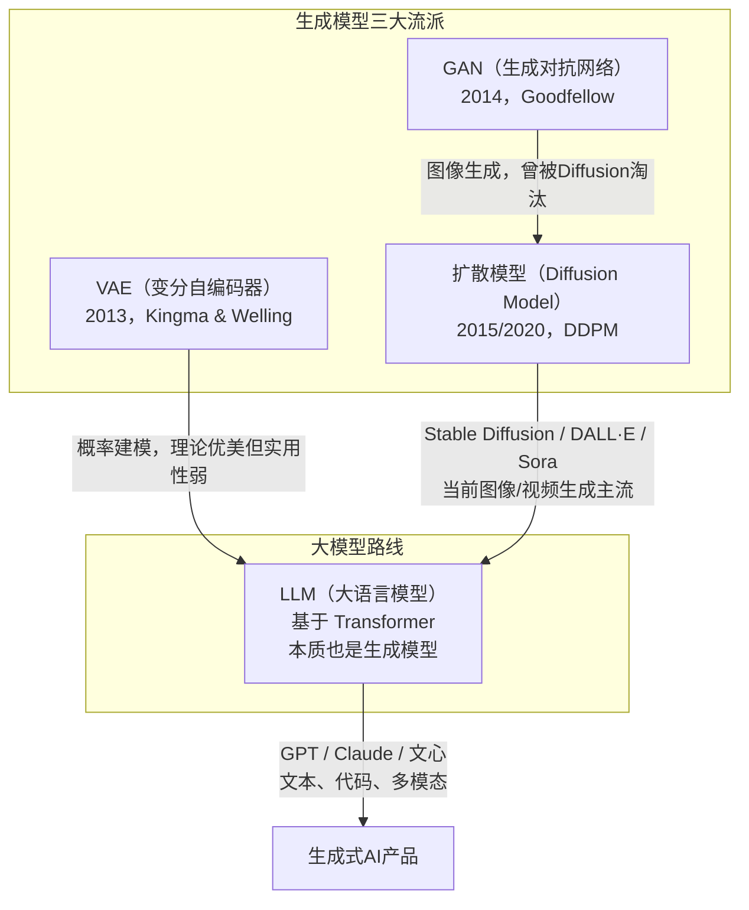
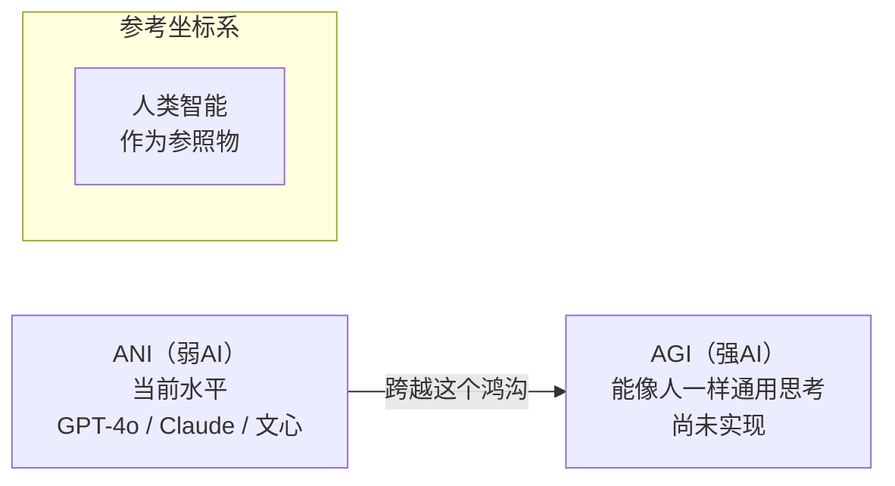

# 14.1 大模型

## 14.1.1 大模型实现原理

### 一、核心概念
- **大语言模型（LLM，Large Language Model）**：它属于深度学习模型，借助海量文本数据进行训练，能够处理和生成自然语言。它具备强大的语言理解和生成能力，可用于问答系统、文本生成、机器翻译等众多自然语言处理任务。例如 ChatGPT、百度文心一言等都属于大语言模型    

- **文本嵌入（Text Embedding）**：这是一种把文本转换为向量的技术。在自然语言处理里，计算机无法直接理解文本，所以需要将文本转换为向量形式，以便计算机进行处理。文本嵌入能够把文本映射到低维向量空间，使得语义相近的文本在向量空间中的距离也相近。这样的向量表示可用于文本分类、信息检索、文本相似度计算等任务    

- **重排序（Rerank）**：在信息检索系统中，初始检索通常会依据某种算法给出一个文档的排序结果。不过这个初始排序可能并非最优，重排序就是在初始排序的基础上，运用更复杂的算法和特征对文档进行再次排序，从而提升检索结果的质量。比如在搜索引擎中，重排序能够让与用户查询更相关的网页排在更靠前的位置    

<!-- - **语音转文本（STT，Speech to text）**：该技术可以将语音信号转换为文本。它借助音频处理和机器学习算法，对语音信号进行分析和识别，把语音中的文字内容提取出来。语音转文本在语音助手、会议记录、视频字幕生成等场景中应用广泛       

- **文本转语音（TTS，Text to Speech）**：这是与语音转文本相反的技术，它能够将文本转换为语音。TTS 系统会对输入的文本进行分析，然后根据语音合成算法生成相应的语音信号。文本转语音常用于有声读物、导航系统、智能客服等场景。     -->

<!-- LLM:大模型
RAG：检索增强
chunk：内容切片
embedding：片段向量化
vectorDB：向量化数据库
AI Agent：就是 可以利用外部工具帮你干活 
MCP：串联AI Agent生态的协议
Distill：蒸馏
Prompt：提示词 -->

<!-- [ollama中文文档](https://ollama.cadn.net.cn/#quickstart) -->

### 二、实现链路（自底向上，硬件→应用产品）
> 越往下越贴近物理硬件，越往上越贴近用户

```mermaid
graph TD
    L1["1.硬件层: GPU/CPU/显存, NVLink/InfiniBand"] --> L2["2.CUDA: GPU编程接口"]
    L2 --> L3["3.算子加速库: cuDNN/cuBLAS/NCCL/Triton"]
    L3 --> L4["4.深度学习框架: PyTorch/TensorFlow + DeepSpeed分布式"]
    L4 --> L5["5.模型架构: Transformer/RNN/Mamba"]
    L5 --> L6["6.训练流程: Tokenizer + 预训练 + SFT/RLHF"]
    L6 --> L7["7.LLM权重: Qwen/Llama/GPT, safetensors/GGUF量化"]
    L7 --> L8["8.推理引擎: vLLM/llama.cpp/HF transformers"]
    L8 --> L9["9.部署运行工具: Ollama/Xinference/TGI"]
    L9 --> L10["10.服务&Agent层: API网关/RAG/Dify"]
    L10 --> L11["11.产品应用层: 豆包/ChatGPT"]
```

1. **硬件层（硅片）**
    GPU（英伟达A100/H100/2080S等）、CPU、内存、显存。
    GPU大量小计算核心，擅长并行矩阵运算（AI最核心计算）。
    - 多机多卡之间靠 NVLink、InfiniBand 互联，网络带宽是大规模训练的瓶颈之一。
    > 早期AI用CPU，算力不足；GPU普及才引爆大模型。

2. **硬件加速API层：CUDA**
    英伟达GPU的编程接口。
    作用：让开发者直接调度GPU上千个计算核心，做矩阵计算。
    - 没有CUDA，GPU只是显卡，没法高效跑AI计算；
    - CUDA是**硬件和软件之间的桥梁**。

3. **算子加速库层**
    基于CUDA封装好的高性能计算库，框架不手写CUDA，直接调用它们。
    - cuDNN（深度学习算子）、cuBLAS（矩阵计算）、NCCL（多卡通信）、Triton（算子编译器）。

4. **深度学习框架层**
    把算子库再封装好，不用手写底层代码。
    - PyTorch、TensorFlow：提供张量、自动求导，用来**训练模型、表达神经网络**；
    - 分布式训练：Megatron-LM、DeepSpeed、FSDP——千亿模型单卡装不下，靠多卡并行训练。
    > 比如：用PyTorch写网络，PyTorch底层调用cuDNN/CUDA跑在GPU上。

5. **模型架构层（算法骨架）**
    定义神经网络怎么连接、怎么计算。
    - RNN/LSTM（早期）；
    - **Transformer**（2017，现在LLM的主流骨架）；
    - Mamba/RWKV（新的非Transformer架构）
    > 架构 = 图纸，规定数据怎么流动。**架构本身不是模型，不是引擎**。

6. **数据与训练流程层**
    架构只是骨架，权重不是一次炼成：
    - Tokenizer：把文本切成token，模型只认token不认字；
    - 预训练（Pretrain）→ 监督微调（SFT）→ 对齐（RLHF/DPO）：先学语言，再对齐人类偏好。

7. **大模型权重层：LLM**
    用海量数据，基于Transformer架构，经上面的流程训练出来，得到一堆参数权重文件。
    - Qwen、Llama、GPT系列都是LLM；
    - LLM = 建好骨架（Transformer）+ 训练填充好千亿参数；
    - 存储格式与量化：safetensors、GGUF；INT8/INT4/FP8量化压缩权重、降低显存，llama.cpp只能跑GGUF格式。
    > 类比：图纸（Transformer）盖好房子（LLM权重）。

8. **推理引擎层（跑LLM的运行时）**
    加载LLM权重，做优化，对外提供生成能力。
    - HuggingFace `transformers`库：通用基础库，可训练可推理，性能普通
    - vLLM、TensorRT-LLM、llama.cpp：**专用推理引擎**，做KV缓存优化、连续批处理，提升吞吐、降低显存占用，生产部署用。
    > 引擎作用：把LLM高效跑在GPU上，底层调用PyTorch/CUDA。

9. **部署运行工具层**
    把引擎包装成可管理、可扩展的服务，自带裸模型API。
    - Ollama、Xinference、TGI（对应mermaid图中的"部署运行工具"）。

10. **服务&Agent层**
    在裸API外面包装：API网关、上下文管理、工具调用、Agent能力、多轮对话、RAG检索增强。
    - Dify这类应用构建平台就属于这层；
    把裸模型变成可访问的Web服务。

11. **产品应用层**
    面向用户的成品（如豆包、ChatGPT）。
    底层：自研大模型 + 自研推理优化引擎 + 上层对话业务逻辑、前端交互。
    用户输入文字，最终下发到推理集群GPU，返回结果。

#### 极简链路一句话
`GPU/集群网络 → CUDA → cuDNN/NCCL算子库 → PyTorch(+DeepSpeed分布式) → Transformer架构 → Tokenizer+预训练+SFT/RLHF → LLM权重(safetensors/GGUF量化) → vLLM推理引擎 → Ollama/TGI部署工具 → API服务 → 应用产品`

<!-- 
引擎比较：
| 引擎                 | 开发团队        | 核心目标                       | 模型支持范围       |
| -------------------- | --------------- | ------------------------------ | ------------------ |
| **HF transformers** | Hugging Face    | 提供全流程工具（训练/推理）    | 极广（数千种模型） |
| **vLLM**             | UC Berkeley     | 高性能LLM推理（生产级）        | 主流LLM（PyTorch） |
| **llama.cpp**        | Georgi Gerganov | 轻量化本地运行（CPU/边缘设备） | GGUF量化模型       |

部署运行工具：
| 特性           | Hugging Face (TGI/Transformers) | Ollama           | Xinference        |
| -------------- | ------------------------------- | ---------------- | ----------------- |
| **核心用户**   | 研究者/开发者                   | 个人用户         | 企业/团队         |
| **模型支持**   | 极广（HF Hub）                  | 有限（精选模型） | 中（支持主流LLM） |
| **部署复杂度** | 高（需配置环境）                | 极低（一键运行） | 中（需集群管理）  |
| **性能**       | 高（TGI/vLLM）                  | 低（适合本地）   | 高（分布式扩展）  |
| **硬件适配**   | 需NVIDIA GPU（TGI）             | CPU/Metal/CUDA   | CPU/GPU/分布式    |
| **典型场景**   | 训练+生产级API                  | 本地快速体验     | 企业内网服务      |
 -->

### 三、名词关系对照表

| 名词                 | 类别         | 定位                                |
| -------------------- | ------------ | ----------------------------------- |
| GPU                  | 硬件         | 计算载体                            |
| NVLink/InfiniBand    | 硬件互联     | 多机多卡集群网络                    |
| CUDA                 | 底层API      | 调度GPU的接口                       |
| cuDNN/NCCL           | 算子加速库   | 高性能算子、多卡通信                |
| PyTorch              | 深度学习框架 | 搭建、训练神经网络                  |
| DeepSpeed/FSDP       | 分布式训练   | 多卡并行训练超大模型                |
| Transformer          | 模型架构     | 神经网络的算法骨架                  |
| Tokenizer            | 数据处理     | 把文本切分为token                   |
| HF transformers库    | 工具库       | 实现Transformer架构，支持训练推理   |
| LLM                  | 模型（权重） | 基于Transformer训练完成的大语言模型 |
| safetensors/GGUF     | 模型格式     | 权重存储格式，GGUF支持量化          |
| vLLM                 | 推理引擎     | 加载LLM，高性能推理服务             |
| llama.cpp            | 推理引擎     | 轻量化本地推理                      |
| Ollama/Xinference/TGI | 部署运行工具 | 把引擎包装成可管理的服务            |
| Dify                 | 应用构建平台 | 封装模型API，提供RAG/Agent/工作流   |
| 豆包                 | AI产品       | 上层应用，封装大模型能力            |

### 四、常见歧义澄清
资料中写的`Transformer(HF)`，**不是Transformer架构，是HF transformers代码库**，属于推理工具库，不是底层算法。这种命名是简写，很容易混淆。

### 五、API服务是 Dify 实现的吗？

不完全是，要分两层看：

1. **裸模型 API —— 引擎自带，不需要 Dify**
    推理引擎/部署工具启动时就自带 API 服务：
    - `vllm serve` 直接提供 OpenAI 兼容接口（`/v1/chat/completions`）
    - Ollama 自带 REST API（`localhost:11434`）
    - TGI、Xinference 同理
    > 链路里的"API服务"最底层是**引擎自己吐出来的**。

2. **Dify 的位置 —— 应用构建平台，在裸 API 之上**
    Dify 属于链路第 10 层（服务&Agent层），它**自己不跑模型**，而是：
    - 接入上面的模型 API（填一个 OpenAI 兼容的 endpoint 就能用）
    - 统一封装多家模型，加上 RAG、知识库、Agent、工作流、对话管理
    - 对外提供**应用级 API** 和 Web 界面
    > 对应 mermaid 图中的第 10 层（服务&Agent层），不在推理引擎那层。

**一句话**：裸模型 API 是 vLLM/Ollama 这些引擎实现的；Dify 是把裸 API 包装成应用的那层，它只是服务层的一种实现——不用 Dify，自己写 FastAPI + LangChain 也能干这事。

### 六、推理模型与非推理模型

* 推理大模型： 推理大模型是指能够在传统的大语言模型基础上，强化推理、逻辑分析和决策能力的模型。它
们通常具备额外的技术，比如强化学习、神经符号推理、元学习等，来增强其推理和问题解决能力。
例如：DeepSeek-R1，GPT-o3在逻辑推理、数学推理和实时问题解决方面表现突出。

* 非推理大模型： 适用于大多数任务，非推理大模型一般侧重于语言生成、上下文理解和自然语言处理，而不强
调深度推理能力。此类模型通常通过对大量文本数据的训练，掌握语言规律并能够生成合适的内容，但缺乏像
推理模型那样复杂的推理和决策能力。

例如：GPT-3、GPT-4（OpenAI），BERT（Google），主要用于语言生成、语言理解、文本分类、翻译
等任务

| 维度     | 推理模型                                         | 通用模型                                       |
| -------- | ------------------------------------------------ | ---------------------------------------------- |
| 优势领域 | 数学推导、逻辑分析、代码生成、复杂问题拆解       | 文本生成、创意写作、多轮对话、开放性问答       |
| 劣势领域 | 发散性任务（如诗歌创作）                         | 需要严格逻辑链的任务（如数学证明）             |
| 性能本质 | 专精于逻辑密度高的任务                           | 擅长多样性高的任务                             |
| 强弱判断 | 并非全面更强，仅在其训练目标领域显著优于通用模型 | 通用场景更灵活，但专项任务需依赖提示语补偿能力 |
| 提示语策 | 1. 提示语更简洁，只需明确任务目标和需求（因其已内化推理逻辑）  2. 无需逐步指导，模型自动生成结构化推理过程（若强行拆解步骤，反而可能限制其能力）。 | 1. 需显式引导推理步骤（如通过CoT提示），否则可能跳过关键逻辑   2. 依赖提示语补偿能力短板（如要求分步思考、提供示例） |

### 七、概率预测与链式推理

|          | 概率预测（快速反应模型，如ChatGPT 4o）     | 链式推理(慢速思考模型，如OpenAI o1)                |
| ------------ | ------------------------------------------ | -------------------------------------------------- |
| 性能表现     | 响应速度快，算力成本低                     | 慢速思考，算力成本高                               |
| 运算原理     | 基于链式思维（Chain-of-Thought），逐步推理 | 问题的每个步骤来得到答案                           |
| 决策能力     | 依赖预设算法和规则进行决策                 | 能够自主分析情况，实时做出决策                     |
| 创造力       | 限于模式识别和优化，缺乏真正的创新能力     | 能够生成新的创意和解决方案，具备创新能力           |
| 人机互动能力 | 按照预设脚本响应，较难理解人类情感和意图   | 更自然地与人互动，理解复杂情感和意图               |
| 问题解决能力 | 擅长解决结构化和定义明确的问题             | 能够处理多维度和非结构化问题，提供创造性的解决方案 |
| 伦理问题     | 作为受控工具，几乎没有伦理问题             | 引发自主性和控制问题的伦理讨论                     |

## 14.1.2 发展阶段

### 阶段1：传统机器学习（~2012前）
- 硬件：CPU为主；
- 没有深度学习，没有Transformer；
- 算法：SVM、决策树，人工提取特征；
- 局限：不能处理语言、图像原始数据，没法做大模型。

### 阶段2：深度学习爆发（2012 AlexNet）
- 硬件：GPU开始用于AI；CUDA成熟；
- 框架：Caffe、TensorFlow；
- 架构：CNN图像，RNN/LSTM处理序列文本；
- 局限：RNN串行计算，长文本效果差，很难并行，做不了超大语言模型。

### 阶段3：Transformer诞生（2017）
Google论文《Attention Is All You Need》提出**Transformer架构**，自注意力机制。
- 支持完全并行训练，长文本建模能力碾压RNN。
> 这是现代LLM的起点，但此时还没有千亿大模型。

### 阶段4：大模型时代（2018~2022）
- GPT1/2/3，LLaMA，大参数量LLM出现；
- 训练：PyTorch + Transformer架构，多卡GPU集群 + CUDA；
- 早期推理：直接用HF transformers库跑，性能差，只能小流量；
- 痛点：推理显存开销巨大，并发请求能力弱。

### 阶段5：生成式 AI 爆发（2022~）
> 这是**Generative AI**真正走入大众视野的阶段。

2022年底 ChatGPT 发布、Stable Diffusion 开源，标志着**生成式 AI（Generative AI）**进入产品化爆发期。vLLM、TensorRT-LLM 等专用推理引擎登场，PagedAttention 等技术解决显存瓶颈，LLM 可以大规模生产部署。

- **Generative AI 的核心特征**：模型从"判别"走向"生成"——不是判断一张图是不是猫，而是凭空生成一张猫的图片、一段文章、一段代码；
- **关键技术路线**：LLM（文本生成）+ 扩散模型（图像/视频生成）+ GAN/VAE（早期生成模型）；
- 同时出现替代架构：Mamba，不依赖 Transformer 注意力；
- 产品化：各类大模型应用上线，豆包、ChatGPT 都属于这个阶段。

### 阶段6：Agent & 多模态（当前正在演进）
LLM + 工具调用、RAG、多模态（图文音），不再只是文本生成。
> 这个阶段的核心命题已经不是"生成得好不好"，而是"能不能真正替人干活"。

## 14.1.3 生成式 AI（Generative AI）

### 一、什么是生成式 AI？

生成式 AI 是一类**能"生成"新内容**的 AI 技术的统称。与传统机器学习（主要做"判别"——给数据打标签、分类、预测）不同，生成式模型学习的是数据的**分布规律**，然后从中**采样**出全新的、模型从未见过的内容。

一句话区分：
- **判别式 AI（Discriminative AI）**：判断"这是什么"——比如图像分类、垃圾邮件过滤、股票涨跌预测；
- **生成式 AI（Generative AI）**：创造"新东西"——比如写文章、画图、写代码、做音乐。

### 二、生成式 AI 的技术谱系

```mermaid
graph TD
    subgraph "生成模型三大流派"
        GAN["GAN（生成对抗网络）<br/>2014，Goodfellow"]
        VAE["VAE（变分自编码器）<br/>2013，Kingma & Welling"]
        DM["扩散模型（Diffusion Model）<br/>2015/2020，DDPM"]
    end
    subgraph "大模型路线"
        LLM["LLM（大语言模型）<br/>基于 Transformer<br/>本质也是生成模型"]
    end
    GAN -- "图像生成，曾被Diffusion淘汰" --> DM
    VAE -- "概率建模，理论优美但实用性弱" --> LLM
    DM -- "Stable Diffusion / DALL·E / Sora<br/>当前图像/视频生成主流" --> LLM
    LLM -- "GPT / Claude / 文心<br/>文本、代码、多模态" --> GEN[生成式AI产品]
```

| 技术 | 擅长生成 | 代表作 | 特点 |
|---|---|---|---|
| **GAN** | 图像 | StyleGAN（人脸生成） | 一度霸主，但训练不稳定，后被扩散模型取代 |
| **VAE** | 图像、音频 | — | 有概率意义但生成质量不如 GAN/扩散 |
| **扩散模型（Diffusion）** | 图像、视频、3D | Stable Diffusion、DALL·E 3、Runway Gen-3、Sora | 当前视觉生成主流，质量碾压 GAN |
| **LLM** | 文本、代码、多模态 | GPT-4o、Claude、文心一言、DeepSeek-V3 | 基于自回归，本质是逐 token 生成的生成模型 |

> **LLM 也是生成式 AI**。虽然大家常说"生成式 AI"特指图像/视频生成，但严格来说，LLM 是最早大规模商用的生成式模型——它逐 token 采样生成文本，和扩散模型从噪声生成图像的本质是一样的：学习分布 → 采样 → 输出新内容。

### 三、生成式 AI vs 传统 AI

| 维度 | 传统 AI（判别式） | 生成式 AI |
|---|---|---|
| 能力 | 识别、分类、预测 | 创造、模拟、生成 |
| 训练目标 | 学到标签规律 | 学到数据分布 |
| 输出 | 标签、概率分数 | 全新内容（文本/图/音频/视频） |
| 典型任务 | 图像分类、推荐系统、风控 | 文章写作、图像创作、代码生成 |
| 学习范式 | 监督学习为主 | 无监督/自监督学习为主 |
| 代表技术 | CNN、SVM、XGBoost | Transformer、Diffusion、GAN |

### 四、一个关键认知：生成 ≈ 超级插值

生成式 AI 不"创造"新知识，它的生成本质上是**训练数据的高维空间插值**。模型见过海量数据后，学到了数据分布，生成时就是在这个分布上采样。

- 优点：能举一反三、组合创新（如把"猫"+"宇航员"+"梵高风格"组合起来生成新图像）；
- 局限：无法突破训练数据的边界，可能产生**幻觉**（生成看起来合理但事实错误的内容）。

## 14.1.4 通用人工智能（AGI）

### 一、定义：什么是 AGI？

**AGI（Artificial General Intelligence，通用人工智能）** 是一个哲学和工程学概念，指一种**能够像人类一样完成任何智力任务**的 AI——不仅仅是下棋、写文章，而是能在陌生环境中自主学习、举一反三、跨领域迁移、理解因果、有自己的目标规划。

当前的大模型（GPT-4、Claude、文心）属于 **ANI（Narrow AI，专用/弱 AI）**，它们在特定任务上可能远超人类（AlphaGo 下围棋、GPT-4o 写代码），但**没有真正的理解能力、没有长期记忆、没有自主规划、无法把一个领域学到的东西迁移到完全陌生的新领域**。

```mermaid
graph LR
    ANI["ANI（弱AI）<br/>当前水平<br/>GPT-4o / Claude / 文心"] -- "跨越这个鸿沟" --> AGI["AGI（强AI）<br/>能像人一样通用思考<br/>尚未实现"]
    subgraph 参考坐标系
        Human["人类智能<br/>作为参照物"]
    end
```

### 二、AGI 需要哪些关键能力？

学界对 AGI 的判定标准尚未统一，但**以下维度是共识**：

| 能力 | 说明 | 当前 LLM 做到了吗 |
|---|---|---|
| **语言理解与生成** | 听、说、读、写，理解隐含语义 | ✅ 强 |
| **知识表示与推理** | 因果推理、逻辑链、数学证明 | ⚠️ 链式推理模型（o1/R1）有所突破，但仍会翻车 |
| **长期记忆** | 跨会话记住事实、用户偏好、世界状态 | ❌ 依赖外部 RAG，内部无真正的持久记忆 |
| **世界模型** | 理解物理世界运作规则（水往低处流、扔东西会落地） | ⚠️ 隐式学到一部分，但没有显式建模 |
| **跨领域迁移** | 学会了骑单车，能快速学会骑摩托 | ❌ 不会，换一个领域就要重新微调 |
| **自主规划与目标** | 给自己设定目标、拆解步骤、执行、反馈修正 | ⚠️ Agent 能做简单规划，但不会自主设长期目标 |
| **具身智能** | 能操作机器人、在物理环境中行动 | ❌ 还在早期实验室阶段 |
| **自我意识/主观体验** | 有"我"的概念、有情感体验 | ❌ 完全没有 |

### 三、当前大模型离 AGI 还有多远？

**乐观派**（如 Sam Altman、Ilya Sutskever）认为：
- 当前 LLM 只是参数规模还不够、训练数据还不够多、上下文窗口还不够长；
- 继续堆算力和数据，"涌现能力"会自然而然出现，AGI 在十年内可实现。

**审慎派**（如 Yann LeCun、Gary Marcus）认为：
- 当前 LLM 的"下一个 token 预测"范式从根本上有局限；
- 真 AGI 需要**因果理解**、**世界模型**、**推理模块**、**具身交互**等新架构，不是 Transformer 简单 scaled up 能达到的；
- 现在的 LLM 本质是"高级仿人对话机"，不是真的"理解"了世界。

**中间立场**：
- 短期 3-5 年，LLM + Agent + 多模态 + 工具调用，会造出在**绝大多数日常知识工作**上接近人类水平的 AI（称之为 **ASI 前期** 或 **接近 AGI 能力**）；
- 但离"像人类一样通用地理解世界、自主设目标、跨领域迁移"还有本质差距，那可能是另一个技术范式的事情。

### 四、为什么 AGI 争议这么大？

核心问题是：**我们不知道"理解"和"生成"的边界在哪里**。

- GPT-4o 能写代码、做数学证明、翻译诗、理解隐喻、做逻辑推理——这到底是"真正理解了"，还是只是"在海量 token 中统计出了下一个最合适的 token"？
- 当模型参数量从 7B → 70B → 1.7T，能力跳跃式提升（涌现能力）——这是量变到质变，还是 Transformer 架构刚好能承载某种 intelligence 的子空间？
- 没有一个实验能证伪"大模型没有真正理解"的假说，所以争论会持续。

### 五、一个实用的分层框架

与其纠结"是不是 AGI"，不如看**能力覆盖度**：

| 层级 | 能力 | 举例 |
|---|---|---|
| **L0 工具（Tool AI）** | 完成单一具体任务 | 语音转文字、图像分类、推荐系统 |
| **L1 助手（Assistant AI）** | 辅助人类完成一个领域的工作 | Copilot 写代码、Notion AI 写文档 |
| **L2 代理（Agent AI）** | 自主拆解目标、调用工具、多步执行 | AutoGPT、Devin 自主写一个网页 |
| **L3 多领域通才（Domain Generalist）** | 在 2+ 领域表现接近专家水平 | 能同时当程序员、产品经理、设计师 |
| **L4 近 AGI（Near AGI）** | 在绝大多数知识工作领域比肩人类 | 几乎能做任何脑力劳动 |
| **L5 AGI** | 完全通用，与人类智能无本质差距 | 能快速学习全新领域、理解物理世界 |
| **L6 超级智能（Superintelligence）** | 全面超越人类 | 有自己的研究能力、科学发现能力 |

> 当前主流大模型产品大概在 **L1-L2**；OpenAI Devin 这类自主编程 Agent 是 **L2→L3** 的探索；**L4 近 AGI** 是行业中长期目标；**L5-L6** 属于人类还没想清楚的范畴。
